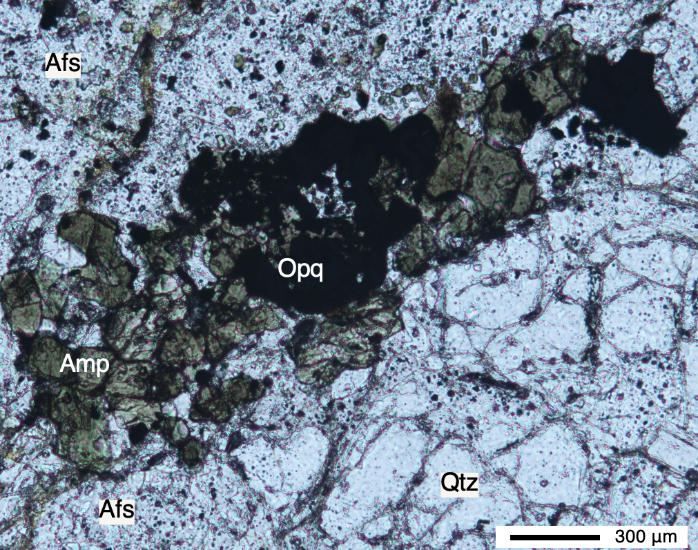
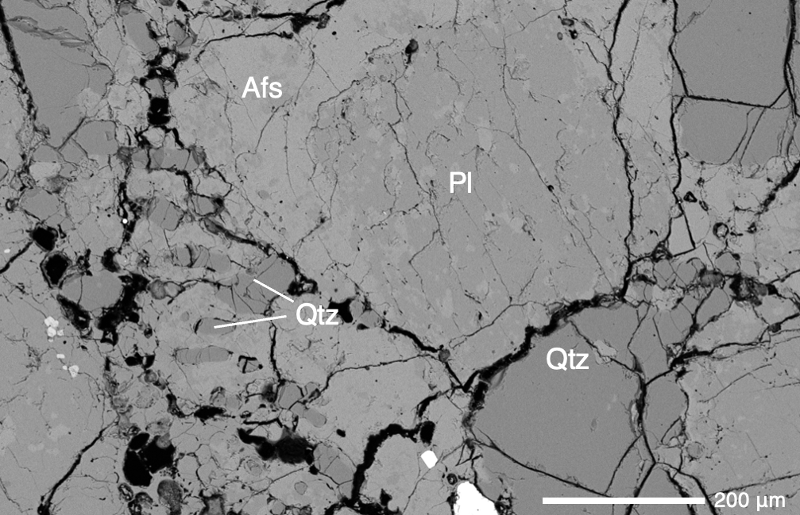
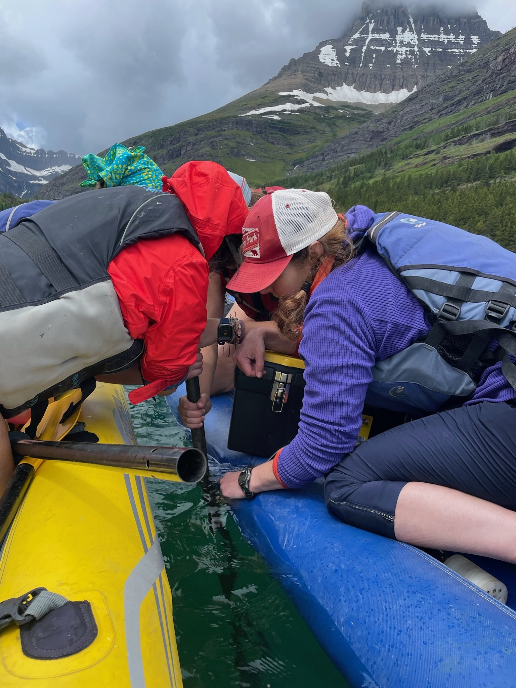
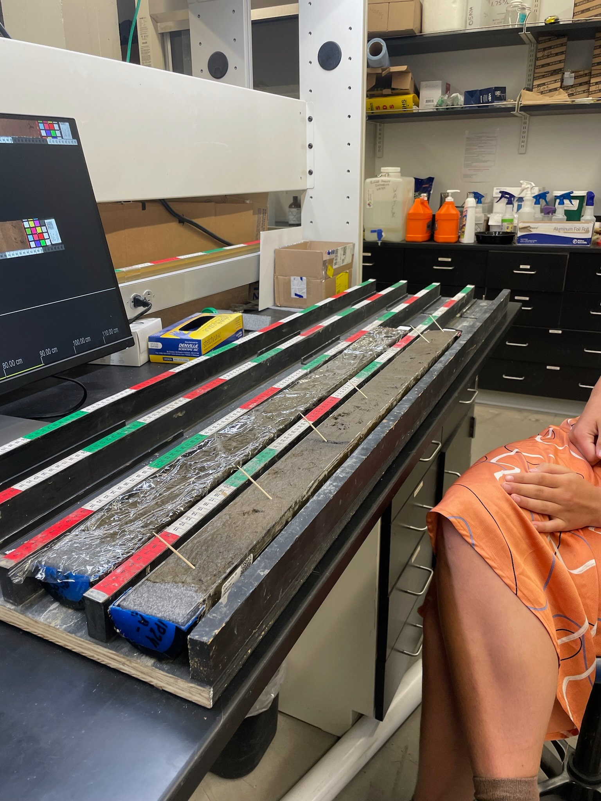

# Mauna Loa
Coming soon!

# Plutonic Lithics Record Crystal Mush Processes Beneath the Ohakuri Caldera

{width=45%}

{width=45%}

This past semester I had the privilege to study abroad in NZ through the [Frontiers Abroad Geology of New Zealnd Program](https://frontiersabroad.com/) and partake in a semester long research project advised by [Prof. Sarah Smithies](https://profiles.canterbury.ac.nz/Sarah-Smithies).

Our study focuses on the magmatic system beneath the Ohakuri Caldera, which, together with the Rotorua Caldera, evacuated \>245 km3 of rhyolitic magma in the paired Ohakuri and Mamaku eruptions around 240ka.

Using petrography and SEM-EDS-BSE, we analyzed 5 plutonic lithic samples from the Ohakuri Caldera in the Taupō Volcanic Zone. Additionally, using feldspar and amphibole compositions, we obtained temperature and pressure estimates, respectively. Granophyric texture dominated the majority of our thin sections, in which quartz and feldspars most likely formed simultaneously through a major decompression event, followed by the infilling of interstitial glass. Thermobarometry estimated that plagioclase formed at approximately 890–910 °C. Amphibole thermobarometry suggests two major crystallization events, with edenite forming at \~2 km depth and gedrite forming at \~6–7 km depth. Glass compositions in our samples differ from those reported in previously studied samples.

# Lacustrine Records of Environmental Change in Eastern Glacier National Park

::: photo-grid
 
:::

This was my first formal research experience under [Prof. Kelly MacGregor](https://www.macalester.edu/geology/facultystaff/kellymacgregor/) and my first exposure to geology field work!

In summer 2024, we collected lake sediment cores from several lakes in the Swiftcurrent Valley to examine changes in sedimentation rate and organic content since \~1800 CE. Preliminary results suggest that lake sedimentation rates increase toward the present, with the highest sedimentation rates occurring in down-valley lakes proximal to greater human activity (e.g., roads, trails, and infrastructure). These rates are an order of magnitude greater than Holocene sedimentation rates identified in previous work.Redrock and Swiftcurrent Lakes are deeper and larger (averaging \~6 m and \~10 m deep, respectively), whereas Fishercap Lake is shallow (\~1 m deep), impacting hydrologic conditions within the lakes. Changes in sediment sources and hydrologic residence times vary between lakes.
